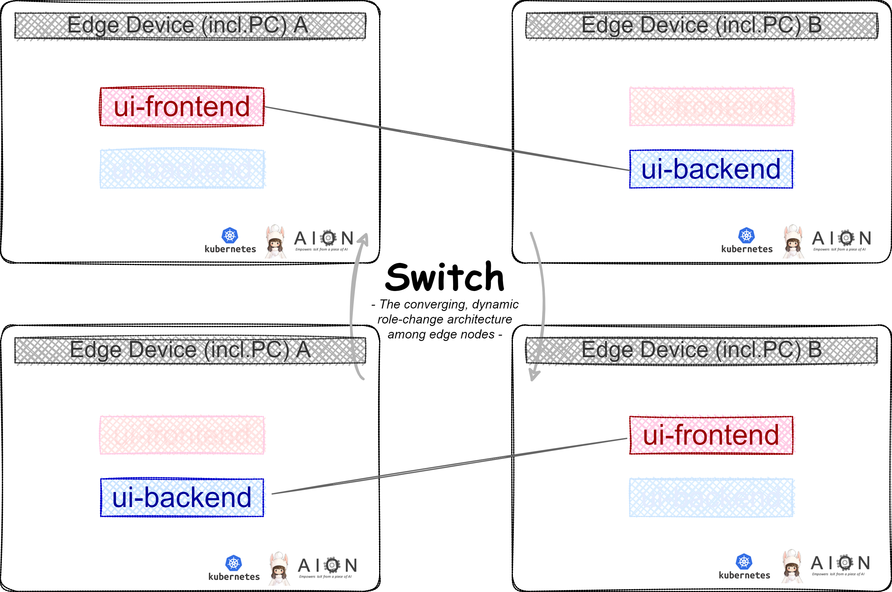

<p align="center"> 
</p> <p align="center">The converging, dynamic role-change architecture among edge nodes</p>

*** 

# switch  
switch は、各エッジデバイス（PCを含む）にデプロイされた UIフロントエンド と UIバックエンド のマイクロサービス機能を、エッジデバイス間で相互に役割分担し、時系列でその役割を入れ替えることを可能にする、アーキテクチャです。  
switch は、クラウドから遮断された、限られた ハードウェア・NWリソース環境において、エッジクラスターNW内のそれぞれのデバイスが効率良く資源配分をされるために、最適なアーキテクチャを提供します。   
switch により、時系列に応じて、エッジコンピューティングクラスター内の 各ノードエッジデバイス（PCを含む）において、次の表のような役割分担が可能となります。  
 

| Role Scenario        | Role of Edge Device A       | Role of Edge Device B       |   
| :------------------- | :-------------------------- | :-------------------------- |   
| Role Scenario I      | UI-Frontend(PC)             | UI-Backend(NVIDIA Jetson等) |  
| Role Scenario II     | UI-Frontend(NVIDIA Jetson等)| UI-Backend(NVIDIA Jetson等) |  
| Role Scenario III    | UI-Frontend(PC)             | UI-Frontend(PC)             |  


## switch のアーキテクチャ  
switch の アーキテクチャ図 です。    



## 動作環境1  
* OS: LinuxOS  
* CPU: ARM/AMD/Intel  
* Kubernetes  
* AION  

## 動作環境2 （フロントエンドUI担当デバイス側、フロントエンドUI は ReactJSを想定） 
- brew -v 3.2.xx  
- node -v 16 以上  
- yarn -v 1.22.xx  
- git  -v 2.30.x  
- FireFox, Google Chrome, 等 のブラウザ

## セットアップ手順 (フロントエンドUI担当デバイス側、以下ではIntel Chip 搭載の Mac を想定）
1. 作業用ディレクトリを作成し、移動します。
```
mkdir ~/dev
cd ~/dev
```

2. ui-frontend のリポジトリをクローンし、移動します。
```
git clone git@bitbucket.org:latonaio/ui-frontend-for-xxxxx.git
cd ui-frontend-for-xxxxx
```

3. 必要なライブラリをインストールします。
```
yarn install
```

4. 環境変数を設定します。
```
mv .env.production .env

# .envを以下のように設定します。
REACT_APP_ENV=development
REACT_APP_API="xxx.xxx.xxx.xxx" # backend側の処理を担当している端末のIPアドレスを記載
```

5. アプリケーションを起動  
```
yarn dev

# 例えばReactJSは、localhost:3000 で起動するので、ブラウザ※1で開きます
※1: FireFox,または Google Chrome推奨です。Safari等は対応しておりません。  
```